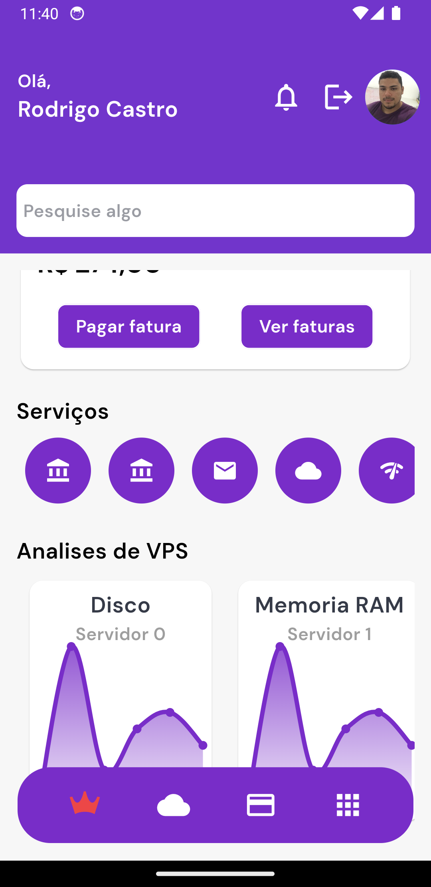

# Red Host App [Construção]


<table>
  <tr>
    <td></td>
    <td></td>
    <td></td>
    <td></td>
    <td></td>
    <td></td>
  </tr>
</table>


Este é um aplicativo Flutter desenvolvido para um estudo de caso. Ele segue a arquitetura limpa (Clean Architecture) e usa BLoC para gerenciamento de estado, fpdart para programação funcional, GetIt para injeção de dependência e Dio para requisições HTTP e design system implementado como package.

## Design System
Estou usando um figma de referencia para o design system
https://www.figma.com/community/file/1167234095518472412

Tou utilizando o backend feito em PHP/Laravel que esta em construção aqui:
https://github.com/tecrodrigocastro/red-host-core

## Estrutura do Projeto
A estrutura do projeto está organizada da seguinte forma: <br>
```css
.
├── design_system/
│   └── lib/
│       ├── src/
│       │   ├── buttons
│       │   ├── cards
│       │   ├── icons
│       │   ├── images
│       │   ├── inputs
│       │   └── theme
│       └── design_system.dart
└── lib/
    └── src/
        └── app/
            ├── features/
            │   ├── auth/
            │   │   ├── data/
            │   │   │   ├── datasources/
            │   │   │   │   └── auth_remote_datasource.dart
            │   │   │   ├── models/
            │   │   │   │   ├── credencial_model.dart
            │   │   │   │   └── user_model.dart
            │   │   │   └── repositories/
            │   │   │       └── auth_repository_impl.dart
            │   │   ├── domain/
            │   │   │   ├── entities/
            │   │   │   ├── repositores/
            │   │   │   │   └── auth_repository_interface.dart
            │   │   │   └── usecase/
            │   │   │       ├── login_usecase.dart
            │   │   │       └── register_usecase.dart
            │   │   └── presentation/
            │   │       ├── bloc/
            │   │       │   ├── auth_bloc.dart
            │   │       │   ├── auth_event.dart
            │   │       │   └── auth_state.dart
            │   │       ├── pages/
            │   │       │   ├── login_page.dart
            │   │       │   └── register_page.dart
            │   │       └── widgets/
            │   ├── base
            │   ├── home
            │   ├── hub
            │   ├── plans
            │   └── splash
            ├── core
            ├── app_widget.dart
            └── main.dart
```
Até o momento...

## Estrutura de Pastas

- **app/features/auth**: Contém a lógica de autenticação do aplicativo, incluindo dados, domínio e apresentação.
- **app/features/home**: Contém a lógica da tela inicial do aplicativo.
- **app/features/splash**: Contém a lógica da tela de splash do aplicativo.
- **app/core**: Contém configurações e utilitários centrais, como cliente HTTP, injeção de dependência, entidades, enums, erros, typedefs e casos de uso.
- **app/utils**: Contém utilitários e helpers usados em todo o aplicativo.

## Bibliotecas Utilizadas
- **[fpdart](https://pub.dev/packages/fpdart)**: Utilizado para programação funcional em Dart.
- **[GetIt](https://pub.dev/packages/get_it)**: Utilizado para injeção de dependência.
- **[Dio](https://pub.dev/packages/dio)**: Utilizado para requisições HTTP. Todas as requisições estão abstraídas no core do projeto.
- **[flutter_bloc](https://pub.dev/packages/flutter_bloc)**: Utilizado para gerenciamento de estado.
- **[google_fonts](https://pub.dev/packages/google_fonts)**: Utilizado para estilização dos textos

